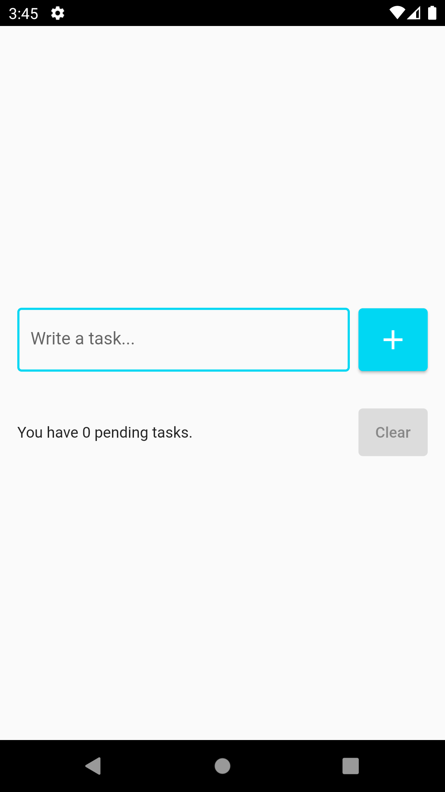
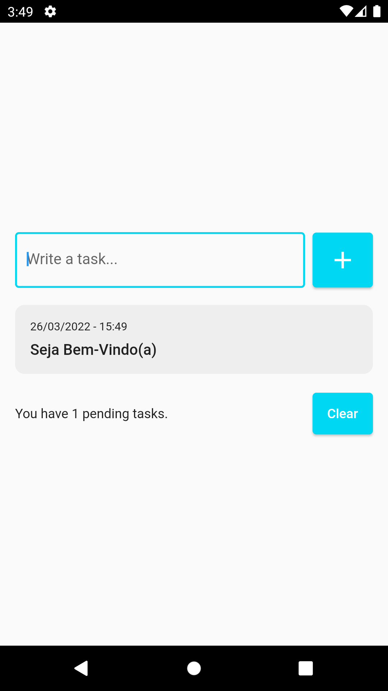

<details>
<summary>
<strong> Read this guide in English </strong>
</summary>
    <ul>
        <li><a href="./README.md"> English </a></li>
    </ul>

</details>

# To-Do List App

Um aplicativo de lista de tarefas simples e amigável que permite excluir e desfazer a tarefa excluída.

## Demonstração

&nbsp;&nbsp;&nbsp;&nbsp;&nbsp;&nbsp;&nbsp;&nbsp;&nbsp;&nbsp;

### Dependências

1. [Intl](https://pub.dev/packages/intl)

1. [Flutter_Slidable](https://pub.dev/packages/flutter_slidable)

1. [Shared_Preferences](https://pub.dev/packages/shared_preferences)

## Instalação

##### 1. Clone o repositório

```bash
git clone https://github.com/edilsonmatola/flutter_to-do_list_app.git
```

##### 2. Entre para o ficheiro desejado

```bash
cd flutter_to-do_list_app
```

### 3. Para executar o aplicativo, basta escrever os seguintes comandos:

```bash
flutter pub get
# flutter emulators --launch "emulator_id" (para obter o simulador Android)
open -a simulator (para obter o simulador iOS)
flutter run
flutter run -d chrome --web-renderer html (para ver a melhor o resultado)
```
