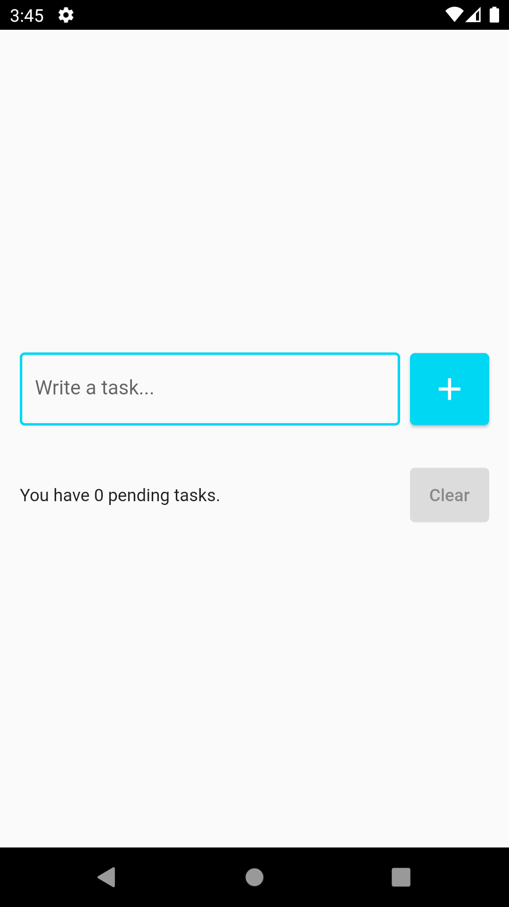
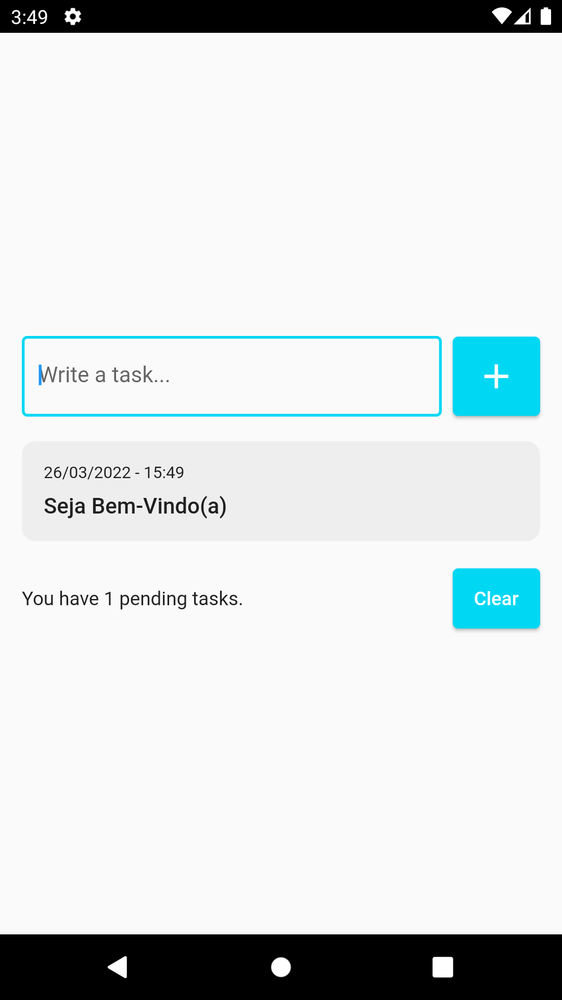
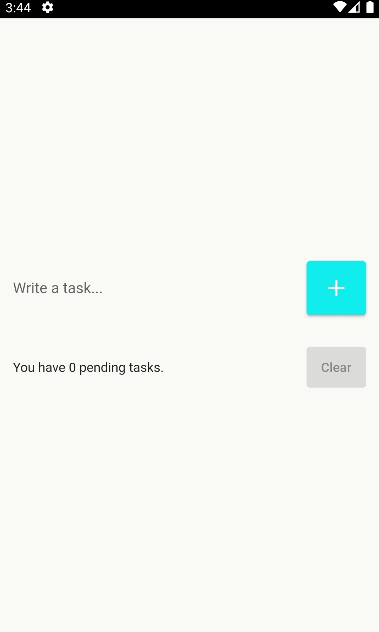

<details>
<summary>
<strong> Leia este guia em Português </strong>
</summary>
    <ul>
        <li><a href="./README-PT-BR.md"> Português </a></li>
    </ul>

</details>

# To-Do List App

A simple user friendly To Do list app that allows you delete and undo the deleted task.

### Demo

&nbsp;&nbsp;&nbsp;&nbsp;&nbsp;&nbsp;&nbsp;&nbsp;&nbsp;&nbsp;

### Dependencies

1. [Intl](https://pub.dev/packages/intl)

1. [Flutter_Slidable](https://pub.dev/packages/flutter_slidable)

1. [Shared_Preferences](https://pub.dev/packages/shared_preferences)

## Installation

##### 1. Clone the repository

```bash
git clone https://github.com/edilsonmatola/flutter_to-do_list_app.git
```

##### 2. Move to the desired folder

```bash
cd flutter_to-do_list_app
```

### 3. To run the app, simply write the following commands:

````bash
flutter pub get
# flutter emulators --launch "emulator_id" (to get Android Simulator)
open -a simulator (to get iOS Simulator)
flutter run
flutter run -d chrome --web-renderer html (to see the best output)
````
